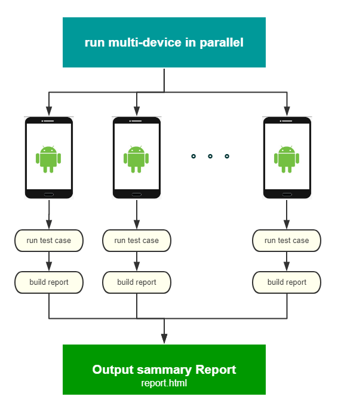

# Introduction
Run tests of Airtest in parallel on multi-device

阅读中文版说明 [点这里](file://./docs/readme_en.md)

# How to run
1. Connect multi-device with adb
2. Install python >3.0 and latest airtest `pip install airtest`
3. Clone or download this sample and run 'python run.py' on the project's folder.

# Airtest multi-device runner diagram

# Results of test sumary report

