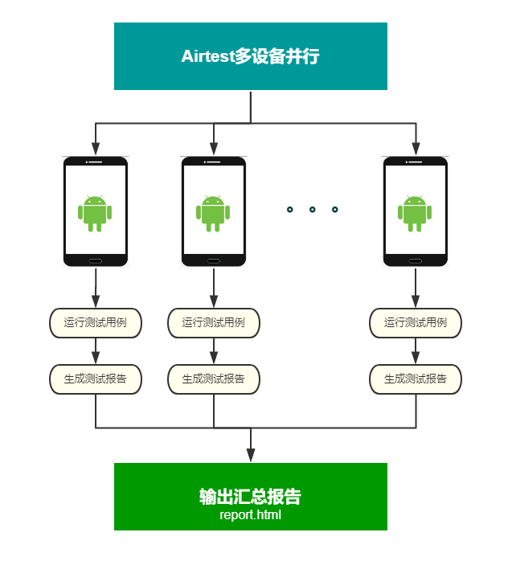

# 介绍
多设备并行运行Airtest测试

For Readme in English, see [readme.md](./docs/readme_en.md)
# 使用步骤
1. 使用adb连接多台设备
2. 安装 python3 环境以及 airtest  `pip install airtest`
3. clone 或者下载样例，打开项目目录，运行代码 `python run.py`

# Airtest 多设备并行测试示意图

# 测试报告效果图

